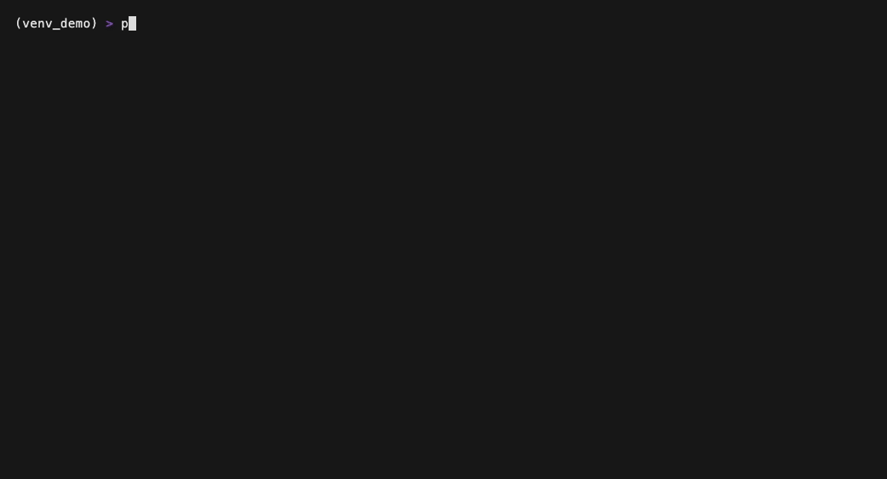

# memtrust

Agent memory backends each publish their own benchmark numbers, on different tests, measured
different ways. memtrust runs the same evals against all four and publishes the raw logs. Run
against the vendors, not by them.

[](https://github.com/RudrenduPaul/memtrust/actions/workflows/ci.yml)
[](https://github.com/RudrenduPaul/memtrust/blob/main/LICENSE)
[](https://pypi.org/project/memtrust-cli/)
[](https://pypi.org/project/memtrust-cli/)

```bash
pip install memtrust-cli
memtrust run --backends mempalace,mem0,zep,openviking --eval all
```



(For contributing to this repo instead of just running it, see [Development](#development) --
`pip install -e ".[dev]"` from a clone.)

**Contents:** [Why this exists](#why-this-exists) · [What it does](#what-it-does) ·
[Commands](#commands) · [How this differs](#how-this-differs-from-trusting-a-vendors-own-numbers) ·
[Contradiction detection](#the-eval-that-actually-matters-contradiction-detection) ·
[Compression fidelity](#the-eval-built-for-the-other-headline-overclaim-compression-fidelity) ·
[Temporal-KG boundary](#the-eval-built-from-mempalaces-own-bug-temporal-kg-boundary-detection) ·
[The landscape](#the-landscape-verified-not-benchmarked) · [Benchmarks](#benchmarks) ·
[GitHub Actions usage](#github-actions-usage) · [Self-host](#self-host) · [Install](#install) ·
[Hosted layer](#what-a-hosted-trust-layer-would-add) · [Backend coverage](#backend-coverage) ·
[Development](#development) · [FAQ](#faq) · [License](#license) · [Success stories](#success-stories)

## Why this exists

If you've compared agent-memory backends recently, you've probably noticed each one leads with a
different accuracy number, on a different benchmark, measured a different way. MemPalace's own
community already flagged the problem in public. Issue [#27](https://github.com/MemPalace/mempalace/issues/27)
on the MemPalace repository, opened April 7, 2026 and still open, documents that a headline 100%
LongMemEval figure, measured with Haiku reranking, wasn't reproducible from the repository's own
benchmark scripts and was pulled from the README as unverifiable. A separate 96.6% figure people
cite everywhere turns out to be mostly ChromaDB's default embeddings doing the work in raw mode,
not MemPalace's own architecture. A "lossless" compression claim (the "AAAK" mode) drops the same
LongMemEval score from 96.6% to 84.2% in practice, a 12.4 percentage point gap. Two internal pull
requests attempting to fix the reporting problem, #433 and #729, were both closed without merging
on April 12, 2026 -- #729 within seven minutes of being opened. As of this writing, the issue has
233 thumbs-up reactions and 39 comments.

None of that means MemPalace, or any other backend, doesn't work. It means nobody outside the
vendor had run the same test, the same way, against every option, and published the raw logs.

memtrust does that. It runs LongMemEval, LoCoMo, and a growing set of evals built specifically for
this project -- 17 of them as of this writing, all registered in the CLI's `--eval` flag. The two
that matter most for understanding what this project is actually for:
contradiction detection, because neither LongMemEval nor LoCoMo tests the question that actually
matters once a memory system sits underneath a production agent -- what happens when a new fact
contradicts an old one? Does the backend flag the conflict? Silently overwrite the old fact with no
audit trail? Serve whichever version it happens to retrieve first? None of the four backends this
project tracks publish a number for that. And compression/round-trip fidelity, built to directly
test claims like the "lossless" one above: it stores content, retrieves it, and scores literal
reconstruction fidelity rather than semantic accuracy, per operating mode a backend exposes (see
`MemoryBackendAdapter.supported_modes`) -- the mechanism that would let a contributor with live
MemPalace credentials actually reproduce the 12.4-point compressed-mode accuracy drop
mempalace/mempalace#27 documents, instead of just citing it. **Neither has been run against a live
MemPalace instance as of this writing** -- both have, however, been run against a live
self-hosted `mem0ai` install; see "Benchmarks" below. The other evals -- ranking quality,
crash recovery, extraction quality, embedding drift, scale/volume stress, lock contention, stats
accuracy, orphan cleanup, result consistency, migration rollback, filter injection, resource-sync
safety, and temporal-KG boundary detection -- each grew out of a specific real bug report against
one of the four tracked backends; see "Success stories" below for the full list.

**Where this stands right now, in one place:** [live benchmark results](#benchmarks) for one
backend (`mem0_direct`, self-hosted `mem0ai`), including a real bug this project's own attempt to
get those numbers surfaced in mem0's default configuration; and [197 real GitHub issues and PRs](#success-stories)
filed against MemPalace, Mem0, Zep/Graphiti, and OpenViking independently root-caused against this
codebase -- 55 (28%) PASS, 16 (8%) PARTIAL, 42 (21%) a genuine capability gap, 84 (43%) not
applicable, every verdict re-verified by a reviewer independent of whoever built the fix.

## What it does

Every command below was actually run against this repo, with zero vendor API keys configured, to
produce the output shown. Nothing here is simulated.

```
$ memtrust run --backends mempalace,mem0,zep,openviking --eval all
memtrust 0.3.3 -- run_id=mt_2026-07-21T004232Z
Backends: mempalace, mem0, zep, openviking   Evals: longmemeval, locomo, contradiction,
resource_sync_safety, compression, ranking_quality, scale_stress, embedding_drift, crash_recovery,
extraction_quality, migration_rollback, filter_injection, lock_contention, stats_accuracy,
orphan_cleanup, result_consistency, temporal_kg_boundary

mempalace: SKIPPED (not configured) -- mempalace is not configured: environment variable
MEMPALACE_STORAGE_PATH is not set. Skipping this backend. See docs/methodology.md for setup
instructions.
mem0: SKIPPED (not configured) -- mem0 is not configured: environment variable MEM0_API_KEY is not
set. Skipping this backend. See docs/methodology.md for setup instructions.
zep: SKIPPED (not configured) -- zep is not configured: environment variable ZEP_API_KEY is not set.
Skipping this backend. See docs/methodology.md for setup instructions.
openviking: SKIPPED (not configured) -- openviking is not configured: environment variable
OPENVIKING_API_KEY is not set. Skipping this backend. See docs/methodology.md for setup
instructions.

Cost: $0.00 (no LLM-judged evals ran -- structural evals only, or judge not configured)

Full report: memtrust-report-2026-07-20.json
```

That's the real, reproducible behavior of a fresh clone with no credentials: every backend reports
SKIPPED, the command exits cleanly, and a valid JSON report is still written. `memtrust --version`
now correctly prints `0.3.3`, matching `pip show memtrust-cli`. Earlier releases printed
`0.0.0+unknown` even when properly installed, because `src/memtrust/__init__.py` read
`importlib.metadata.version("memtrust")` while the installed distribution is actually named
`memtrust-cli` -- kept in the FAQ below for the record rather than deleted, since silently erasing
a bug the moment it's fixed is exactly the kind of curation this project exists to push back on in
other people's benchmarks. Set the relevant environment variable for any backend you want to
actually test (`MEM0_API_KEY`, `ZEP_API_KEY`, `OPENVIKING_API_KEY`, `MEMPALACE_STORAGE_PATH`) and
that backend runs for real against its live API instead of being skipped.

The eval logic itself is proven offline, against the bundled synthetic fixtures and, for several
adapters, the real installed vendor packages with only the network boundary mocked, by the test
suite:

```
$ pytest --cov=memtrust --cov-report=term-missing
... (33 module rows total; the 11 most relevant to this README are shown below)
Name                                                          Stmts   Miss  Cover
-------------------------------------------------------------------------------------
src/memtrust/adapters/base.py                                   305     16    95%
src/memtrust/adapters/mempalace_adapter.py                      254     15    94%
src/memtrust/adapters/mem0_adapter.py                            140     12    91%
src/memtrust/adapters/mem0_direct_adapter.py                     277     34    88%
src/memtrust/adapters/openviking_adapter.py                      178     18    90%
src/memtrust/adapters/zep_graphiti_adapter.py                     63      3    95%
src/memtrust/adapters/zep_graphiti_selfhosted_adapter.py         161     24    85%
src/memtrust/evals/contradiction.py                              127      2    98%
src/memtrust/evals/compression.py                                 86      1    99%
src/memtrust/evals/temporal_kg_boundary.py                        90      3    97%
src/memtrust/receipt.py                                          118     10    92%
-------------------------------------------------------------------------------------
TOTAL                                                            4147    276    93%

589 passed, 8 skipped in 3.57s
```

This is an excerpt, not the full table -- the weakest-covered module in the repo,
`evals/mempalace_metadata_scale.py` (70%), isn't one of the 11 shown above; run the command
yourself for the complete per-module breakdown.

589 passing tests across 33 source modules, 93% overall statement coverage, 98% on the
contradiction-detection eval, 99% on compression/round-trip fidelity, 97% on the temporal-KG
boundary eval, 85-95% across the adapter layer. The 8 skips are live-`mempalace`-package tests that
only run with the optional `mempalace-direct` extra installed (`pip install -e
'.[dev,mempalace-direct]'`). Every test mocks its HTTP or wire
layer, or uses an in-memory fake backend -- none of them touch a real network, though a meaningful
share of the adapter tests now import and exercise *real installed vendor classes* directly
(`mem0ai==2.0.12`'s embedder and vector-store modules, and -- gated behind the optional
`mempalace-direct` extra -- the real `mempalace.mcp_server` functions), mocking only the outermost
network or wire-client boundary rather than the whole library. `graphiti-core` is not installed in
this environment, so its self-hosted adapter's tests still run against a hand-written Protocol
double built to match the real package's confirmed method signatures, not the real classes -- see
`docs/methodology.md`'s adapter confidence table for exactly which claim rests on which kind of
verification.

## Commands

```
$ memtrust --help
Usage: memtrust [OPTIONS] COMMAND [ARGS]...

  memtrust: an independent, reproducible benchmark harness for agent-memory
  backends.

Options:
  --version  Show the version and exit.
  --help     Show this message and exit.

Commands:
  keygen  Generate a new Ed25519 keypair for signing `memtrust run`...
  report  Read a prior `memtrust run` JSON report and print a formatted...
  run     Run the eval suite against the requested backends.
  verify  Verify a signed receipt produced by `memtrust run --sign`.
```

| Command | Flags | What it does |
|---|---|---|
| `memtrust run` | `--backends TEXT` comma-separated list or `all` (default `all`) · `--eval TEXT` comma-separated from `longmemeval,locomo,contradiction,resource_sync_safety,compression,ranking_quality,scale_stress,embedding_drift,crash_recovery,extraction_quality,migration_rollback,filter_injection,lock_contention,stats_accuracy,orphan_cleanup,result_consistency,temporal_kg_boundary`, or `all` (default `all`) · `--output FILE` (defaults to `./memtrust-report-<date>.json`) · `--locomo-dataset-path FILE` points the LoCoMo eval at a real, downloaded `locomo10.json` instead of the bundled synthetic fixture (memtrust does not bundle or auto-fetch the real dataset) · `--locomo-exclude-question-ids-file FILE` excludes known-bad-ground-truth LoCoMo question IDs from scoring · `--scale-stress-n-records INTEGER` (default `500`) sets how many synthetic records the scale-stress eval stores and re-queries · `--sign FILE` writes a signed `<output>.receipt.json` alongside the report, proving it was produced by the holder of the given Ed25519 private key | Runs the eval suite against the requested backends. A backend without its credential env var set prints `SKIPPED` and the run continues -- this command never crashes on missing credentials. `temporal_kg_boundary` only applies to the `mempalace` backend (the only adapter that wires `kg_add`/`kg_invalidate`/`kg_query`); requesting it against any other backend reports `not_applicable`, not an error. |
| `memtrust report REPORT_PATH` | positional path to a prior JSON report | Reads a report written by `memtrust run` and prints a formatted summary. |
| `memtrust keygen` | -- | Generates a new Ed25519 keypair for signing reports with `run --sign`. |
| `memtrust verify RECEIPT_PATH` | -- | Verifies a signed receipt produced by `memtrust run --sign`; a tampered or mismatched receipt fails verification. |
| `memtrust --version` | -- | Prints the installed version (currently `0.3.3`). |

Every line above came straight from running `memtrust --help`, `memtrust run --help`, and
`memtrust report --help` against this repo. Nothing here is invented.


## How this differs from trusting a vendor's own numbers

Every backend memtrust tracks publishes its own benchmark numbers. None of them publish the same
benchmark, scored the same way, with the same held-out discipline. memtrust doesn't ask you to
trust it instead: it asks you to read the raw logs. Every run's methodology, prompt templates,
dataset versions, and scoring rubric are published in `docs/methodology.md`, versioned alongside
the code that produced them. If the methodology has a flaw, it's a flaw you can point to in a
specific file and line, not something buried in a vendor's internal eval pipeline.

General-purpose LLM eval frameworks (promptfoo, DeepEval, RAGAS, and similar tools) are mature and
widely used, but none of them ship a memory-backend adapter abstraction or a contradiction-
detection eval out of the box -- they're built for RAG quality, red-teaming, and general prompt
evaluation, not for comparing how different memory systems handle a fact that changes over time.
memtrust is narrower and more specific on purpose.

## The landscape (verified, not benchmarked)

Real, publicly checkable numbers as of this writing (`gh api repos/<org>/<repo>`), not
memtrust-run scores -- accuracy and contradiction-handling comparisons stay in the "Benchmarks"
section below until a live run actually produces them:

| Backend | GitHub stars | Self-reported description |
|---|---|---|
| [MemPalace](https://github.com/MemPalace/mempalace) | 57,512 | "The best-benchmarked open-source AI memory system. And it's free." |
| [Mem0](https://github.com/mem0ai/mem0) | 61,318 | "Universal memory layer for AI Agents" |
| [Zep / Graphiti](https://github.com/getzep/graphiti) | 28,978 | "Build Real-Time Knowledge Graphs for AI Agents" |
| [OpenViking](https://github.com/volcengine/OpenViking) | 27,016 | "Self-evolving Context Database for AI Agents. Unify Agent Memory, Knowledge RAG and Skills." |

None of these numbers say anything about which backend handles a contradicted fact correctly --
that's the whole reason the harness exists. Star count measures adoption, not correctness.

## The eval that actually matters: contradiction detection

LongMemEval and LoCoMo both measure recall: can the backend remember a fact you told it earlier.
That's necessary but not sufficient. The harder question is what a backend does when two facts
conflict: you tell it your meeting is at 2pm, then later say it moved to 3pm. Does it flag the
change? Overwrite silently? Serve whichever one it retrieves first? `memtrust`'s classifier stores
a fact, stores a contradicting fact, queries for it, then checks the actual retrieved content for
both values, rather than trusting whatever conflict signal the adapter itself reports. See
`src/memtrust/evals/contradiction.py` and the scoring-logic section of `docs/methodology.md` for
exactly how that classification works.

## The eval built for the other headline overclaim: compression fidelity

mempalace/mempalace#27 documents two separate overclaims, not one: the LongMemEval score gap
described above, and a "lossless" compression claim that measured 12.4 percentage points lower in
practice under a compressed operating mode. memtrust could not previously reproduce that second
number at all -- there was no way to tell an adapter "run this under mode X vs mode Y" through the
shared interface. `MemoryBackendAdapter.store()`/`query()` now accept an optional `mode: str |
None` parameter, and `MemoryBackendAdapter.supported_modes` lets an adapter declare which mode
strings it actually understands (`MemPalaceAdapter.supported_modes` is `("raw", "AAAK")`, the two
names mempalace/mempalace#27 itself uses -- see `src/memtrust/adapters/mempalace_adapter.py` for
the exact provenance and confidence caveat on those names). Adapters with no mode variants accept
and ignore the parameter, so this is a purely additive, backward-compatible interface change.

`src/memtrust/evals/compression.py` runs the same store-then-retrieve round trip once per mode a
backend reports, and scores each round trip with a direct, deterministic character-level
similarity ratio (`fidelity_ratio()`, via `difflib.SequenceMatcher` -- not an LLM judge, since a
"lossless" claim is a literal-reconstruction claim, not a semantic one). This is what would let a
contributor with live MemPalace credentials point `memtrust run --eval compression` at it and
reproduce a "raw vs AAAK" fidelity gap directly. **As of this writing this eval has not been run
against a live MemPalace instance** -- it has been run against a live self-hosted `mem0ai` install
(mean fidelity 31.6%, see "Benchmarks" below); see `docs/methodology.md` for the same
live-credentials caveat that applies to every other eval and backend not yet measured live.

## The eval built from MemPalace's own bug: temporal-KG boundary detection

MemPalace/mempalace#1913 (fixed by merged PR#1914, contributor ggettert) described a real,
concrete bug: `_temporal_filter_sql`'s `as_of` point-in-time query used a closed interval on both
ends, so a fact whose `valid_to` equaled the query's exact `as_of` instant still matched. Hand-roll
a fact change as `kg_invalidate(ended=T)` immediately followed by `kg_add(valid_from=T)` at the
identical boundary instant -- the exact pattern MemPalace's own pre-fix agent guidance told every
caller to do -- and an `as_of=T` query returns both the just-ended fact and its just-started
successor at once, so a single-valued fact reports two contradictory answers with no error.
`src/memtrust/evals/temporal_kg_boundary.py` reproduces that exact hand-rolled sequence against
`MemPalaceAdapter`'s `kg_add()`/`kg_invalidate()`/`kg_query()` and classifies the result with a new
`TemporalBoundarySignal` taxonomy, distinct from `ConflictSignal` and `RankingSignal` because it
concerns one narrow, structurally different failure: two facts sharing one instant, not a
contradiction across time or a ranking-order question.

Honest scope, stated the same way this project states it for every other eval: the real
`mempalace` PyPI package is not installed in this build environment, and PR#1914's fix had not
shipped in a released `mempalace` version as of this adapter's live-verified 3.5.0 build -- it
lands under the package's `[Unreleased]` changelog section. `tests/test_temporal_kg_boundary.py`
proves the *classification logic* is correct against two hand-written fake implementations that
reproduce the confirmed pre-#1914 (closed-interval) and post-#1914 (half-open-interval) SQL
comparison exactly. **This has not been run against a live MemPalace instance.** It is wired into
`memtrust run --eval temporal_kg_boundary` (see "Commands" above); against any backend other than
`mempalace`, it reports `not_applicable` rather than an error.

## Benchmarks

**Live results: mem0_direct (self-hosted), July 2026.** MemPalace, Zep, and OpenViking are still
not yet measured against a live backend -- see "Backend coverage" below for the confidence level
on each adapter. Mem0 has one real result, produced against the actual `mem0ai` OSS library
running self-hosted -- in-process, via `Mem0DirectAdapter`, backed by a local Qdrant instance and
the OpenAI API for embeddings and extraction -- not against Mem0's hosted Platform API. Keep that
distinction in mind before reading this as a claim about the hosted product.

```
$ export MEM0_DIRECT_EMBEDDER_PROVIDER=openai
$ export MEM0_DIRECT_VECTOR_STORE_PROVIDER=qdrant
$ export MEM0_DIRECT_VECTOR_STORE_URL=http://localhost:6333
$ memtrust run --backends mem0_direct --eval contradiction,compression,extraction_quality
memtrust 0.3.2 -- run_id=mt_2026-07-20T210918Z
Backends: mem0_direct   Evals: contradiction, compression, extraction_quality

mem0_direct: configured, running evals...
  Running Contradiction-Detection against mem0_direct...
    flagged: 0.0%  silent-overwrite: 100.0%  served-stale: 0.0%  empty-or-lost: 0.0%
  Running Compression/Round-Trip-Fidelity against mem0_direct...
    fidelity by mode -- default: 31.6%
  Running Extraction-Quality against mem0_direct...
    junk-retained: 0.0%  valid-lost: 100.0%
    feedback-loop-duplicate: 0.0%

Cost: $0.00 (no LLM-judged evals ran -- structural evals only, or judge not configured)
```

The full raw report is committed at `leaderboard/mem0_direct-2026-07-20.json`, and `leaderboard/data.json`
carries the contradiction numbers into the static leaderboard site (`mempalace`/`mem0`/`zep`/`openviking`
still show `not_measured` there; `mem0_direct` is the one real row).

What that means case by case, not just the percentage:

- **Contradiction detection, 7/7 cases: every contradicting fact silently overwrote the old one.**
  0% were flagged as a conflict, 0% served stale, 0% empty-or-lost. Tell it your meeting moved from
  2pm to 3pm and it stores the new fact with no signal that anything changed -- this is exactly the
  question LongMemEval and LoCoMo don't test, and exactly what "Why this exists" above is about.
- **Compression/round-trip fidelity, 5 cases: 31.6% mean literal character-level reconstruction.**
  This is expected, not a defect -- mem0's design goal is semantic fact extraction, not verbatim
  storage, so a literal-reconstruction score was never going to be high. It quantifies what "not
  built for lossless storage" concretely means for this backend: ask it what you said and you get
  the gist back, not your words.
- **Extraction quality, 15 cases (12 deliberately junk, 3 deliberately valid): 0% junk retained,
  100% of the valid cases lost.** All 12 junk inputs (boot-file restating, cron heartbeat noise,
  system dumps, hallucinated-profile bait) were correctly rejected. All 3 valid-content cases were
  also dropped -- stored but never came back on retrieval. The valid-side sample is small (n=3);
  treat this as a signal worth digging into further, not a settled number.

**A real bug this run surfaced in mem0ai itself, not in memtrust.** Getting any of the numbers
above required a fix first: a fresh `mem0ai==2.0.12` install with nothing but `OPENAI_API_KEY` set
fails every single LLM-based extraction call, out of the box, for anyone. mem0's own default model
(`mem0/llms/openai.py`: `self.config.model = "gpt-5-mini"`) is a reasoning-tier model that only
accepts the API's default temperature, but mem0's own reasoning-model detection
(`mem0/llms/base.py`'s `reasoning_models` set) checks for the string `"gpt-5o-mini"`, not
`"gpt-5-mini"` -- two different strings, so the check never fires, and mem0 sends `temperature=0.1`
on every call regardless. The result is a `400 Unsupported value: 'temperature' does not support
0.1 with this model` error on every extraction call, silently caught by mem0 and reported by
memtrust as `N/A (no scoreable cases)` rather than a real result. `Mem0DirectAdapter` now works
around it by passing `is_reasoning_model=True` explicitly -- mem0's own documented override for
exactly this situation -- see `src/memtrust/adapters/mem0_direct_adapter.py`'s "Default LLM
extraction is broken out of the box" section for the full citation. No upstream mem0ai issue filed
for this as of this writing.

To reproduce this or measure the remaining three backends:

```bash
export MEM0_API_KEY=...          # and/or
export ZEP_API_KEY=...
export OPENVIKING_API_KEY=...
export MEMPALACE_STORAGE_PATH=...
export MEMTRUST_JUDGE_API_KEY=...   # needed for LongMemEval/LoCoMo grading; contradiction-detection doesn't need it

memtrust run --backends mempalace,mem0,zep,openviking --eval all
memtrust report memtrust-report-<date>.json
```

The command prints per-backend accuracy and contradiction-handling rates, writes a full JSON
report, and prints an estimated cost for any LLM-judged evals that ran. `MemPalaceAdapter`'s
drawer and knowledge-graph calls are now live-verified against a real installed instance (see
"Backend coverage" below), but OpenViking's memory-write/query paths, and parts of the
self-hosted Mem0 and Zep/Graphiti adapters, are still built against best-effort interpretations of
documented or source-read product concepts rather than a live-confirmed API -- see the confidence
table in `docs/methodology.md` before treating any adapter's output as authoritative, and consider
that table's gaps a standing invitation to contribute a fix.

**Labeling requirement for any future `accuracy` figure published here.** LongMemEval and LoCoMo
`accuracy` grades the LLM judge's verdict on raw retrieved-record content directly -- there is no
answer-generation step in either eval runner. This is not the same measurement as the official
LongMemEval/LoCoMo leaderboards' generate-then-judge QA-accuracy scores. Any `accuracy` number
this project publishes for those two evals must be labeled "retrieval-graded accuracy," not bare
"accuracy," and must not be directly compared to leaderboard figures without that caveat. See
`docs/methodology.md`'s "Retrieval-graded accuracy vs. generated-answer accuracy" section.

## GitHub Actions usage

Run the suite on a schedule and publish results to the leaderboard:

```yaml
name: memtrust-leaderboard
on:
  schedule:
    - cron: "0 9 * * 1"  # weekly
  workflow_dispatch: {}

jobs:
  benchmark:
    runs-on: ubuntu-latest
    steps:
      - uses: actions/checkout@v4
      - uses: actions/setup-python@v5
        with:
          python-version: "3.12"
      - run: pip install memtrust-cli
      - run: memtrust run --backends mempalace,mem0,zep,openviking --eval all --output leaderboard/data.json
        env:
          MEM0_API_KEY: ${{ secrets.MEM0_API_KEY }}
          ZEP_API_KEY: ${{ secrets.ZEP_API_KEY }}
          OPENVIKING_API_KEY: ${{ secrets.OPENVIKING_API_KEY }}
          MEMTRUST_JUDGE_API_KEY: ${{ secrets.MEMTRUST_JUDGE_API_KEY }}
      - run: git add leaderboard/data.json && git commit -m "Update leaderboard" && git push
```

This repo's own CI (`.github/workflows/ci.yml`) runs lint, type-check, test, and a dependency
security audit on every push and pull request -- no vendor credentials required, since every test
runs fully offline.

## Self-host

```bash
git clone https://github.com/RudrenduPaul/memtrust
cd memtrust
pip install -e ".[dev]"
export MEM0_API_KEY=...
memtrust run --backends mem0 --eval all
```

Point an adapter at your own backend, or run the suite against your own conversation data instead
of the bundled synthetic fixtures (see `docs/methodology.md`'s note on swapping in the real
LongMemEval/LoCoMo datasets). Nothing leaves your machine unless you choose to publish it.

## Install

### npx (agent-native)

Both PyPI and npm are live. `pip install memtrust-cli` works today, and so does the `npx` command
below -- `npm install memtrust-cli` no longer 404s.

For CI and agent runners that have Node.js available but not necessarily a Python toolchain:

```bash
npx memtrust-cli run --backends mempalace,mem0,zep,openviking --eval all
```

The npm package is named `memtrust-cli` so it is unambiguous as a CLI tool at a glance (and so it
doesn't collide with any future `memtrust` JS library package). `npx` always resolves the package
name to its matching `bin` entry automatically, so `npx memtrust-cli ...` is what reliably works
for a zero-install first run. Once installed, the package also exposes the shorter `memtrust`
command as a second `bin` alias -- matching the underlying Python CLI's own command name -- so you
are not stuck typing `memtrust-cli` for every subsequent invocation; `memtrust run ...` works too.

This is not a zero-dependency install: `npx memtrust-cli` still fetches `memtrust` from PyPI on
first use. What it removes is no Python toolchain to provision by hand -- `npx memtrust-cli`
handles the interpreter and package fetch for you via a bundled, verified copy of Astral's
[`uv`](https://github.com/astral-sh/uv). Each platform package bundles a genuine, SHA-256-verified
copy of `uv`'s own GitHub release binary (fetched at npm package-publish time, never at end-user
install time), and its `bin` shim runs `uv tool run --from memtrust==<pinned version> memtrust
<args>`, which transparently bootstraps a Python interpreter and installs that exact pinned
`memtrust` release from PyPI, caching it after the first run. The npm package is pinned to its own
version -- bump `npm/memtrust-cli/package.json`'s version when a new PyPI release ships, and every
subsequent install resolves to that exact release, not whatever happens to be newest at run time.

## What a hosted trust layer would add

The harness, adapters, and leaderboard in this repo are the entire OSS surface, and they're
sufficient on their own to compare backends. A hosted layer on top of this -- described here, not
built -- would add continuous regression monitoring that re-runs the suite automatically whenever
a tracked backend ships a new release, private scorecards that run the same methodology against a
team's own data shape instead of the public sample fixtures, and a compliance-report export for
teams whose security or legal review needs a documented third-party artifact rather than a
free-text summary. None of that exists yet. If it's ever built, it stays additive to the free
harness, never a requirement for using it.

## Backend coverage

The MemPalace row below used to say "needs verification against a live instance" -- it needed more
than that. Every prior version of `MemPalaceAdapter` called a `mempalace.Palace` class
(`Palace(storage_path=...)` exposing `.remember()`/`.recall()`/`.invalidate()`) that never existed
in the real, installed package. `python3 -c "import mempalace; hasattr(mempalace, 'Palace')"`
returns `False`; grepping every `class` definition across the installed package turns up nothing
named `Palace` anywhere. Every test that appeared to pass before this rewrite was exercising a
hand-written fake standing in for that guess, never the real thing -- `store()`/`query()`/
`update()` had never actually worked against a live MemPalace install, in this project's entire
history, until this rewrite. `src/memtrust/adapters/mempalace_adapter.py` was rewritten from
scratch against the real, plain module-level functions in `mempalace.mcp_server`
(`tool_add_drawer`, `tool_search`, `tool_update_drawer`, `tool_delete_drawer`,
`tool_kg_add`/`tool_kg_invalidate`/`tool_kg_query`) -- every return shape documented in the
adapter's module docstring was captured by calling those functions live against a real, local
chromadb-backed palace, not read off a docstring and trusted. It's the kind of mistake this whole
project exists to catch in other people's benchmarks; finding it in memtrust's own adapter and
shipping the fix in the open, rather than quietly patching it, is the more useful story.

| Backend | Adapter status | Confidence (see docs/methodology.md) |
|---|---|---|
| MemPalace | Implemented -- drawer API + knowledge-graph API | High on the real `mempalace.mcp_server` functions this adapter now calls, live-verified against an installed `mempalace` 3.5.0 instance (see above). Still best-effort on compression-mode names (`"raw"`/`"AAAK"`) and on whether `degraded_retrieval` warnings are ever populated by the installed version -- see the adapter's module docstring for both caveats stated plainly. |
| Mem0 | Implemented -- hosted Platform API, self-hosted OSS server, and a direct in-process library adapter | High on the hosted Platform API and on what the installed `mem0ai==2.0.12` library's embedder/vector-store code actually does (confirmed by reading its real source, exercised directly in tests); medium-high on the self-hosted OSS server's route shape (confirmed from source, not run against a live server). |
| Zep / Graphiti | Implemented -- hosted Zep Platform API and a self-hosted `graphiti-core` adapter | Medium-high on the hosted API's documented contradiction-handling behavior; medium on the self-hosted adapter's wire-level shape (every method signature confirmed by reading `graphiti-core`'s real source, not by running it against a live Neo4j/FalkorDB instance -- the package isn't installed in this environment). |
| OpenViking | Implemented | Medium on architecture, low on exact memory-write/query paths -- still the adapter most likely to need correction against a live instance. |

Adding a backend adapter is the primary contribution path -- see `CONTRIBUTING.md`.

## Development

```bash
pip install -e ".[dev]"
ruff check . && ruff format --check .
mypy --strict src/memtrust
pytest --cov=memtrust --cov-report=term-missing --cov-fail-under=80
pip-audit
```

`.pre-commit-config.yaml` wires ruff and mypy into `pre-commit` if you'd rather run these on every
commit than remember to run them by hand.

## FAQ

**What is memtrust, and what actually makes it different from reading a vendor's own benchmark
page?** It's a CLI harness that runs the same evals (LongMemEval, LoCoMo, and 15 others registered
in `--eval`, including a contradiction-detection eval none of the four tracked backends publish a
number for) against MemPalace, Mem0, Zep/Graphiti, and OpenViking, and prints the raw output rather
than a curated summary. The differentiator isn't a proprietary scoring model; it's that nobody
outside the vendor had previously run the same test, the same way, against every option, with the
full methodology published alongside the code that produced it (`docs/methodology.md`). See "Why
this exists" above for the MemPalace LongMemEval overclaim (mempalace/mempalace#27) that motivated
the project.

**Does memtrust support my platform, and what happens if it doesn't?** The npm wrapper
(`memtrust-cli`) ships six platform-specific optional-dependency packages --
`@memtrust-cli/darwin-x64`, `@memtrust-cli/darwin-arm64`, `@memtrust-cli/linux-x64`,
`@memtrust-cli/linux-arm64`, `@memtrust-cli/win32-x64`, and `@memtrust-cli/win32-arm64` -- each
bundling a verified `uv` binary for that exact platform (`npm/memtrust-cli/bin/memtrust.js`).
`npm install` picks whichever one matches `process.platform`/`process.arch` at install time. On an
unsupported combination (32-bit x86, or any platform outside that list), the wrapper exits with a
clear `no prebuilt uv binary available for <platform>/<arch>` error instead of a silent failure. The
underlying `memtrust` PyPI package itself only requires Python 3.11+, so `pip install memtrust-cli`
remains the fallback path on any platform the npm wrapper doesn't cover.

**Do I need a Python toolchain installed to use memtrust?** Not if you go through the npm wrapper.
`npx memtrust-cli run ...` runs `uv tool run --from memtrust==<pinned version> memtrust <args>` under
the hood, and `uv` provisions its own isolated Python interpreter and installs the exact pinned
`memtrust` release from PyPI on first use, caching it after that. If you already have Python 3.11+,
`pip install memtrust-cli` (the PyPI package name) works directly with no Node.js involved.

**How does memtrust compare to a general-purpose LLM eval framework like RAGAS?** RAGAS evaluates
RAG pipelines and other LLM applications with objective metrics and synthetic test-data generation;
it has no memory-backend adapter abstraction and no eval built around a fact contradicting an
earlier one, because that's not the problem it's built to solve. memtrust is narrower on purpose: it
only tracks four named agent-memory backends and its non-recall evals (contradiction detection,
compression/round-trip fidelity, temporal-KG boundary detection) exist specifically to test claims
those four backends make about themselves. If you need broad RAG or prompt-evaluation coverage,
RAGAS or a similar framework is the right tool; if you need to check whether a memory backend
silently drops or overwrites a contradicted fact, memtrust is the one built for that question.

**Why did `memtrust --version` used to print a version that didn't match what pip said I
installed?** This was a real, shipped bug through 0.3.1, not a hypothetical one: installing
`memtrust-cli` from PyPI into a clean virtualenv and running `pip show memtrust-cli` reported the
correct version, but `memtrust --version` printed `0.0.0+unknown` regardless, because
`src/memtrust/__init__.py` read `importlib.metadata.version("memtrust")` -- the wrong distribution
name -- instead of `version("memtrust-cli")`, the name the package is actually installed under.
0.3.2's fix was itself incomplete: it hardcoded the lookup to `"memtrust-cli"`, which broke the
separate `memtrust` mirror package (see "Can I `pip install memtrust` instead of
`memtrust-cli`?" below) the same way in reverse -- a `pip install memtrust` environment has no
`memtrust-cli` entry in its own installed-package metadata at all, so the lookup always missed and
fell through to the same `0.0.0+unknown` fallback. Fixed for real in 0.3.3: the lookup now tries
`memtrust-cli` first, falls back to `memtrust`, and only reports `0.0.0+unknown` if neither
distribution name is installed. `memtrust --version` now matches `pip show` under either package
name.

**Can I `pip install memtrust` instead of `memtrust-cli`?** Yes -- `memtrust` is a real, separate
PyPI package, kept at the same version as `memtrust-cli` on every release, publishing the identical
source. It exists because the npm wrapper's `bin/memtrust.js` pins `uv tool run --from
memtrust==<version>` (not `memtrust-cli`), so a working `npx memtrust-cli` depends on the
`memtrust` name staying live and in sync. `memtrust-cli` is the name to lead with in new
documentation, since the `-cli` suffix makes it unambiguous as a CLI tool at a glance; `memtrust`
is a legitimate, supported install path, not a typo or a squatted name.

**Has memtrust actually been run against a live memory backend, or is this all synthetic?** Both,
and the README doesn't blur the line. The eval logic itself is proven against bundled synthetic
fixtures and, for several adapters, real installed vendor packages with only the network boundary
mocked (see the pytest coverage table above). One backend has a real live result: `mem0_direct`,
the self-hosted `mem0ai` OSS library (not Mem0's hosted Platform API), run against contradiction,
compression, and extraction-quality -- see "Benchmarks" above for the exact numbers and a real bug
that run surfaced in `mem0ai` itself. MemPalace, the hosted Mem0 Platform API, Zep, and OpenViking
have not yet been run against a live backend with real credentials as of this writing. The
"Backend coverage" table gives a per-adapter confidence level (high/medium/low) for exactly this
reason; run it yourself against your own credentials to get a live-verified number.

**Can I use memtrust commercially, and does it require attribution?** Yes. It's licensed under
Apache License 2.0 (see `LICENSE`), which permits commercial use, modification, and distribution,
and requires you to preserve the license and copyright notice and to note any changes you make to
the code. It does not require you to open-source your own product just because you depend on
memtrust.

**How do I get real accuracy numbers for the backends still marked "not yet measured"?** Set the
credential environment variable for whichever backend you want to test
(`MEMPALACE_STORAGE_PATH`, `MEM0_API_KEY`, `ZEP_API_KEY`, `OPENVIKING_API_KEY`, plus
`MEMTRUST_JUDGE_API_KEY` for LLM-judged evals like LongMemEval and LoCoMo), then run
`memtrust run --backends <name> --eval all` and `memtrust report <output-file>`. A backend with no
credential configured prints `SKIPPED` and the run still completes and writes a valid JSON report --
see "What it does" and "Benchmarks" above for the exact commands.

## License

Apache 2.0. See `LICENSE`.

## Success stories

197 real issues/PRs filed by real contributors against MemPalace, mem0, Zep/Graphiti, and
OpenViking have been independently root-caused against this codebase: does the solution, as it
actually exists today, let you diagnose or resolve what was reported? 55 (28%) verify as a clean
PASS, 16 (8%) as PARTIAL (evidence captured, needs a human to
interpret further, or only part of the issue is covered), 42 (21%) as a genuine capability gap this
harness doesn't close yet, and 84 (43%) as not actually applicable (feature requests,
already-fixed-upstream, or genuinely out of scope). Every verdict below has been re-verified live
against the current codebase by a reviewer independent of whoever built the fix, not just cited
from a changelog. Full write-ups and validation evidence are tracked internally; the summary here
is for anyone deciding whether this harness would have caught their own bug.

**The headline story is about memtrust's own bug, not a vendor's.** Every version of
`MemPalaceAdapter` before this rewrite called a `mempalace.Palace` class -- `Palace(storage_path=
...)` exposing `.remember()`/`.recall()`/`.invalidate()` -- that never existed in the real,
installed package. `python3 -c "import mempalace; hasattr(mempalace, 'Palace')"` returns `False`;
nothing named `Palace` appears anywhere in the installed package's source. Every test that appeared
to pass was exercising a hand-written fake standing in for that guess -- `store()`/`query()`/
`update()` had never once worked against a live MemPalace install. `src/memtrust/adapters/
mempalace_adapter.py` was rewritten against the real `mempalace.mcp_server` functions, with every
documented return shape captured by calling them live against a real local instance. A project
built to catch other vendors overclaiming found the same failure mode in its own code, and the fix
shipped in the open rather than quietly. See "Backend coverage" above for the full account.

**MemPalace**
- [#1754](https://github.com/MemPalace/mempalace/pull/1754) (@rodboev): a checkpoint recovery fix
  for silently quarantined dim-None pickles. memtrust's contradiction eval couldn't previously tell
  "silently quarantined" apart from "no update primitive at all"; it now can
  (`ConflictSignal.EMPTY_OR_LOST`).
- [#1929](https://github.com/MemPalace/mempalace/pull/1929) (@jrzmurray): a fix for NUL bytes
  silently corrupting a ChromaDB index. memtrust's `store()` used to trust "no exception" as proof
  of a durable write; an opt-in read-after-write verification step now catches this.
- [#1450](https://github.com/MemPalace/mempalace/pull/1450) (@lealbrunocalhau): a fix for an empty
  embedding response getting scored as a wrong answer instead of flagged as infra failure. Same
  fix as #1754 above.
- [#1823](https://github.com/MemPalace/mempalace/pull/1823) / [#1543](https://github.com/MemPalace/mempalace/pull/1543)
  (@fatkobra): lock and write-integrity fixes that pointed at the same read-after-write gap #1929
  closed.
- [#1913](https://github.com/MemPalace/mempalace/issues/1913) / [PR#1914](https://github.com/MemPalace/mempalace/pull/1914)
  (@ggettert): a temporal-KG `as_of` boundary bug where a fact ending at exactly the query instant
  still matched alongside its successor. memtrust's new temporal-KG boundary eval reproduces the
  exact hand-rolled `kg_invalidate()`-then-`kg_add()` sequence that triggers it -- see "The eval
  built from MemPalace's own bug" above for the honest not-yet-live-verified caveat.
- [PR#1890](https://github.com/MemPalace/mempalace/pull/1890) / [#1889](https://github.com/MemPalace/mempalace/issues/1889)
  (@JosefAschauer): an `authored_at` chronology tie-break fix for `_hybrid_rank`. memtrust's ranking
  classifier now credits a top-level `authored_at` field, not just one nested under `metadata`, as
  a genuine ranking-driving signal.

**mem0**
- [#5973](https://github.com/mem0ai/mem0/pull/5973) (@abhay-codes07, superseded by
  [#5992](https://github.com/mem0ai/mem0/pull/5992)): an empty-string entity-id filter scoping bug.
  memtrust's mem0 adapter only reached the hosted Platform API and had no delete operation at all,
  so it couldn't have caught this. A self-hosted adapter with tested delete/delete_many primitives
  now can.
- [#4297](https://github.com/mem0ai/mem0/pull/4297) (@utkarsh240799): a dimension auto-detection
  fix. The self-hosted adapter now routes to the right deployment, though no test yet reproduces
  this specific bug end to end, so this one is partial, not fully caught.
- [#4573](https://github.com/mem0ai/mem0/issues/4573) (@jamebobob): a 32-day audit of 10,134 real
  mem0 entries finding 97.8% junk. memtrust's new extraction-quality eval and
  `ExtractionQualitySignal` taxonomy cover the audit's own junk categories, including its
  808-duplicate feedback-loop case.
- [PR#5980](https://github.com/mem0ai/mem0/pull/5980) (@HrushiYadav): a filter-injection fix for
  the Elasticsearch vector store. A new filter-injection eval exercises the real, installed
  `mem0.vector_stores.elasticsearch.ElasticsearchDB._validate_filter()` directly and confirms it
  rejects the exact malicious filter shape (`{"user_id": {"$ne": ""}}`) this PR fixed.
- [#4956](https://github.com/mem0ai/mem0/issues/4956) (@NDNM1408): an open proposal that mem0's
  add-only pipeline surfaces stale, contradictory facts with no recency signal. memtrust's
  contradiction eval now runs the same literal add-only scenario (two `store()` calls, no explicit
  update) against this taxonomy.
- [#4884](https://github.com/mem0ai/mem0/issues/4884) (@wangjiawei-vegetable): a hardcoded
  English-only tokenizer silently degrading non-Latin-script retrieval. A new
  `LanguageDegradationSignal` and non-Latin-script fixtures now catch this shape --
  `Mem0DirectAdapter`-specific (it reads `query(explain=True)`'s real per-result diagnostic
  fields, a capability only that adapter exposes) and, like `embedder_cost.py`'s cost-attribution
  eval and `episode_temporal_leak.py`'s Graphiti-specific eval, not yet wired into `memtrust run
  --eval`'s general list; call `run_language_degradation_eval()` directly, or see the
  `test_query_language_degradation_*` tests in `tests/test_mem0_direct_adapter.py`, until that CLI
  surface exists.

**Zep / Graphiti**
- [#1489](https://github.com/getzep/graphiti/issues/1489) (@brentkearney): a bi-temporal
  `invalid_at` correctness gap. memtrust's contradiction classifier used to discard Graphiti's own
  `invalid_at` metadata and infer everything from a fixed top-5 text match, misreading a correctly
  flagged case as a silent overwrite. It now checks the metadata first.
- [#1275](https://github.com/getzep/graphiti/issues/1275) (@rafaelreis-r, still open): O(n)
  entity-resolution context growth silently dropping episodes past roughly 300 ingested. A new
  self-hosted `graphiti-core` adapter plus a scale/volume-stress eval now tracks a fixed "anchor"
  record's recall across ascending checkpoints against real `add_episode()` ingestion -- the same
  shape this issue describes.
- [#836](https://github.com/getzep/graphiti/issues/836) (@matthiaslau) / [#920](https://github.com/getzep/graphiti/issues/920)
  (@markwkiehl): two separate crashes in `update_communities()`/`resolve_edge_contradictions()` --
  a too-many-values-to-unpack error and a tz-naive/aware datetime comparison error. A new
  `CrashSignal` classification recognizes both exact shapes instead of surfacing an opaque generic
  exception.
- [PR#1222](https://github.com/getzep/graphiti/pull/1222) (@david-morales) / [PR#1183](https://github.com/getzep/graphiti/pull/1183)
  (@Milofax): FalkorDB RediSearch syntax errors from empty or unescaped fulltext queries. A new
  `CrashSignal.QUERY_SANITIZATION_ERROR` recognizes both issues' verbatim filed error text.
- [#1467](https://github.com/getzep/graphiti/issues/1467) (@elimydlarz, open, zero engagement):
  `GeminiEmbedder` silently returning the wrong vector count. A new
  `CrashSignal.EMBEDDING_BATCH_COUNT_MISMATCH` catches this once Gemini embedder support is wired
  into the self-hosted adapter.

**OpenViking**
- [#3029](https://github.com/volcengine/OpenViking/issues/3029) (@dfwgj, still open): Feishu resync
  silently deleting user-managed files. memtrust had no way to observe this failure mode at all; a
  dedicated resource-sync-safety eval now seeds generated and user files, triggers a resync, and
  checks what survives.
- [#2850](https://github.com/volcengine/OpenViking/issues/2850) (@lg320531124, still open): BM25
  search silently returning empty results at scale. A dedicated scale/volume-stress eval
  (`memtrust run --eval scale_stress`) now stores a large synthetic corpus and re-queries it at
  ascending checkpoints to reproduce the *shape* of this condition -- recall collapsing past a
  volume threshold with no exception raised.
- [#1581](https://github.com/volcengine/OpenViking/issues/1581) (@0xble, fix rejected, still live
  upstream): `v2_lock_max_retries=0` silently means unlimited retries, not zero. A new
  lock-contention eval asserts a bounded response-time budget under concurrent-write contention.
- [#1255](https://github.com/volcengine/OpenViking/issues/1255) (@SeeYangZhi): a stats endpoint
  silently returning zero despite persisted memories. A new `get_stats()`/`StatsResult` primitive
  and dedicated stats-accuracy eval now catch this.
- [#2966](https://github.com/volcengine/OpenViking/issues/2966) (@lRoccoon, unaddressed upstream):
  legacy uint16-truncated records that are permanently undeletable. A new
  `CrashSignal.LEGACY_CORRUPT_RECORD_UNDELETABLE` now surfaces this instead of a silent no-op.
- [#204](https://github.com/volcengine/OpenViking/issues/204) (@ponsde, closed): non-deterministic
  search results (Jaccard similarity 0.11 across identical queries) from a self-diagnosed dimension
  mismatch. A new result-consistency eval computes pairwise Jaccard similarity over repeated
  identical queries to catch this class directly.

**Cross-project**
- [OneNomad-LLC/przm-bench](https://github.com/OneNomad-LLC/przm-bench) (@mattstvartak): a peer
  benchmarking project shipped cryptographic receipt signing; memtrust had none. `memtrust` now has
  real Ed25519 signing/verification (the `cryptography` library, not a hand-rolled scheme) via
  `memtrust keygen` / `run --sign` / `verify` -- a tampered receipt correctly fails verification,
  a genuine one correctly passes.

Several PARTIAL and FAIL -- capability gap rows above and elsewhere in the full 197-row set remain
open, deliberately not counted as fixed: some point at real gaps this harness genuinely can't close
yet without a live vendor credential, and inflating a near-miss to PASS defeats the entire point of
an independently-verified benchmark. See the confidence caveats throughout this README and in
`docs/methodology.md` for exactly which claims rest on which kind of evidence.

